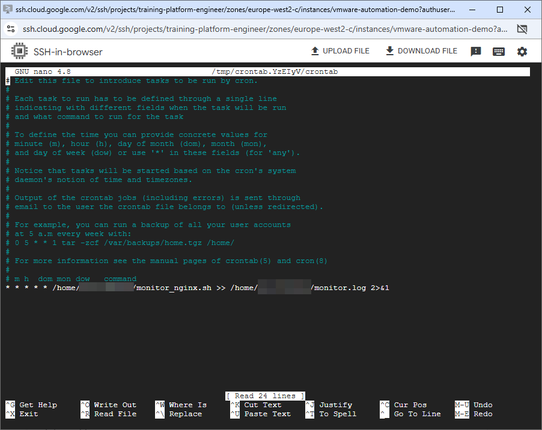
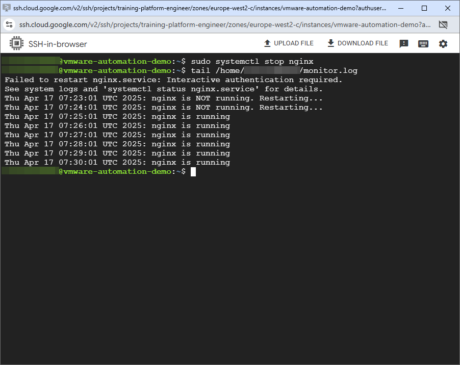

# 🖥️ Legacy VM Automation (Self-Healing Nginx)

This project simulates legacy system automation, inspired by VMware-style environments.  
A Bash script monitors the `nginx` service on a VM and automatically restarts it if it fails — enabling simple, effective **self-healing** automation.

---

## 📁 Project Structure

```text
vmware-legacy-automation/
├── monitor_nginx.sh
├── images/
│   ├── cronjob-configured.png
│   └── nginx-restart-detected-by-script.png
└── README.md
```

---

## 🚀 Steps

### ✅ 1. Install nginx on your VM

```bash
sudo apt update
sudo apt install nginx -y
sudo systemctl status nginx
```

---

### ✅ 2. Create the Automation Script

```bash
nano monitor_nginx.sh
```

Paste the following:

```bash
#!/bin/bash

SERVICE="nginx"
if systemctl is-active --quiet $SERVICE; then
  echo "$(date): $SERVICE is running"
else
  echo "$(date): $SERVICE is NOT running. Restarting..."
  sudo /bin/systemctl restart nginx
fi
```

Make it executable:

```bash
chmod +x monitor_nginx.sh
```

---

### ✅ 3. Configure sudo access (no password for restart)

```bash
sudo visudo
```

Add:

```text
USERNAME ALL=(ALL) NOPASSWD: /bin/systemctl restart nginx
```

---

### ✅ 4. Schedule the script with Cron

```bash
crontab -e
```

Add this line:

```bash
* * * * * /home/USERNAME/monitor_nginx.sh >> /home/USERNAME/monitor.log 2>&1
```

📸 Screenshot:  


---

### ✅ 5. Test the Automation

Manually stop nginx:

```bash
sudo systemctl stop nginx
```

Then wait and check:

```bash
tail -f /home/USERNAME/monitor.log
```

📸 Screenshot:  


---

## 📌 Result

- Simple self-healing logic for legacy services
- Real-world automation pattern, often used in VMware/enterprise setups
- Can be extended for other critical services

---

## 🧑‍💻 Author

Made by [Azin Behdarvand](https://www.linkedin.com/in/azin-behdarvand)  
GitHub: [github.com/AzinBehdarvand](https://github.com/AzinBehdarvand)
